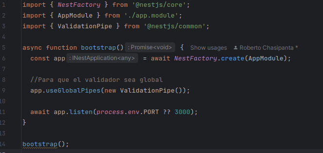

# Validadores

```shell
yarn add class-validator class-transformer
```


```js
@Controller('videos')
@UsePipes(new ValidationPipe())
export class VideosController {
  @Post()
  create(@Body() createVideoDto: CreateVideoDto) {
    return this.videosService.create(createVideoDto);
  }
}
```
```js
import {
  IsNotEmpty,
  Length
} from 'class-validator';

export class CreateVideoDto {
  @IsNotEmpty()
  @Length(1, 15) title: string;
  description: string;
  src: string;
}

```

## Para que el validador sea global a todos los controladores
